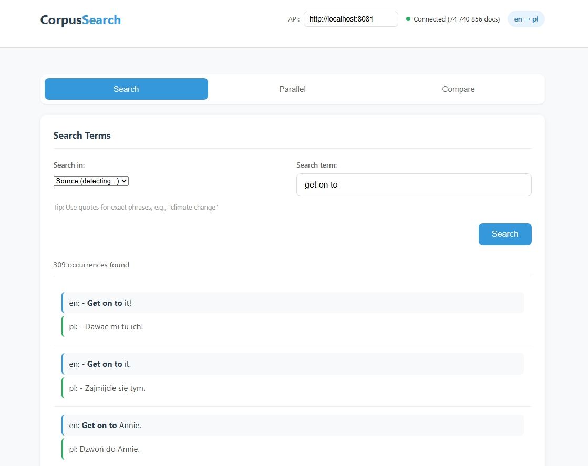

# Corpus Lucene Service

A high-performance REST service for parallel corpus queries using Apache Lucene. Designed for translators and lexicographers to search translation memories with industry-strength speed and scalability.

## Features

- **Multi-language support** - 40+ language pairs with language-specific analyzers
- **Fast document counting** - Count occurrences of terms across any supported language
- **Concordance search** - Find parallel sentences with surrounding context
- **Parallel text retrieval** - Cross-language search for translation pairs, with pagination via `limit`/`offset`
- **Term comparison** - Compare frequency of multiple terms/variants
- **REST API** - Simple JSON endpoints for integration
- **Streaming index build** - Handle corpora with billions of sentences

## Quick Start

### Build

```bash
mvn clean package
```

### Run the Server

```bash
java -Xmx4g -jar target/corpus-lucene-service-*.jar serve --index /path/to/index --port 8082
```

### Build Index from PostgreSQL

```bash
java -jar target/corpus-lucene-service-*.jar build \
  --jdbc "jdbc:postgresql://localhost/dictionary_analytics" \
  --user your_user --password your_password \
  --index /path/to/index \
  --source-lang en --target-lang de
```

## Web Interface

A simple web interface is included for translators to search the corpus:



## Supported Languages

The service supports 40+ languages with language-specific analyzers:

| Code | Language | Analyzer |
|------|----------|----------|
| ar | Arabic | StandardAnalyzer |
| bg | Bulgarian | StandardAnalyzer |
| cs | Czech | StandardAnalyzer |
| da | Danish | StandardAnalyzer |
| de | German | StandardAnalyzer |
| el | Greek | StandardAnalyzer |
| en | English | StandardAnalyzer |
| es | Spanish | StandardAnalyzer |
| fa | Persian | StandardAnalyzer |
| fi | Finnish | StandardAnalyzer |
| fr | French | StandardAnalyzer |
| hi | Hindi | StandardAnalyzer |
| hu | Hungarian | StandardAnalyzer |
| it | Italian | StandardAnalyzer |
| nl | Dutch | StandardAnalyzer |
| pl | Polish | MorfologikAnalyzer |
| pt | Portuguese | StandardAnalyzer |
| ro | Romanian | StandardAnalyzer |
| ru | Russian | StandardAnalyzer |
| sv | Swedish | StandardAnalyzer |
| tr | Turkish | StandardAnalyzer |
| uk | Ukrainian | StandardAnalyzer |
| ... | and 20+ more | StandardAnalyzer |

View all supported languages: `GET /languages`

## API Endpoints

### Health Check

```bash
GET /health
```

Response:

```json
{
  "status": "ok",
  "docs": 74740856,
  "heapUsedMb": 57,
  "heapMaxMb": 4096,
  "uptimeSeconds": 36
}
```

### Count Terms

```bash
GET /count?q={term}&field={lang}
```

Example:

```bash
curl "http://localhost:8082/count?q=Butterfly&field=de"
```

Response:

```json
{
  "query": "Butterfly",
  "field": "de",
  "count": 1234
}
```

### Concordance Search

```bash
GET /concordance?q={term}&field={lang}&limit=100&offset=0
```

Example:

```bash
curl "http://localhost:8082/concordance?q=Übersetzung&field=de&limit=10"
```

### Parallel Text Search

```bash
GET /parallel?{source_lang}={term}&{target_lang}={translation}&limit=100&offset=0
```

Example for German-English:

```bash
curl "http://localhost:8082/parallel?de=Haus&en=house&limit=10&offset=20"
```

### Compare Terms

```bash
POST /compare
Content-Type: application/json

{
  "terms": ["house", "home", "building"],
  "field": "en"
}
```

### Upload Data

```bash
POST /upload
Content-Type: application/json

{
  "sourceLang": "de",
  "targetLang": "fr",
  "sentences": [
    {"source": "Guten Tag", "target": "Bonjour"},
    {"source": "Danke schön", "target": "Merci beaucoup"}
  ]
}
```

### List Supported Languages

```bash
GET /languages
```

## Use Cases for Translators

1. **Term frequency analysis** - Compare how often different terms appear in context
2. **Translation verification** - Find example translations for specific terms
3. **Collocations discovery** - See how words are typically translated together
4. **Parallel concordance** - View source and target sentences side-by-side
5. **Term variant comparison** - Compare "house" vs "home" vs "building" frequencies

## Requirements

- Java 17+
- 4GB RAM minimum (for large indices)

## Architecture

- **Lucene 9.11.1** - Search index with language-specific analyzers
- **Jetty 11** - HTTP server
- **Gson** - JSON serialization
- **Streaming architecture** - Handles billions of sentences without OOM

## License

MIT License - see [LICENSE](LICENSE) file.

## Acknowledgments

Inspired by TMLookup by András Farkas - a simple but powerful tool that served the translation community for years. While TMLookup used SQLite for simplicity, this service leverages Apache Lucene to handle massive corpora with sub-millisecond query times and enterprise-grade reliability.
